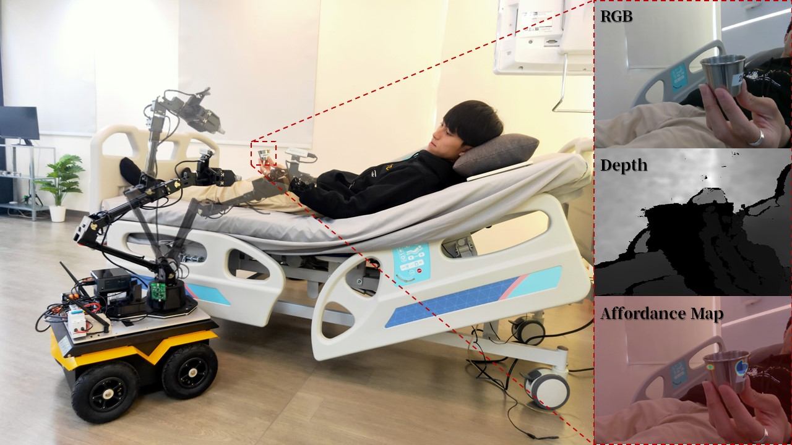
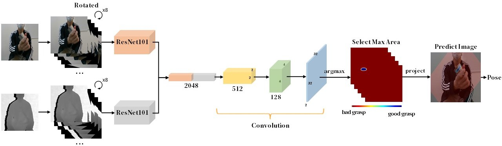
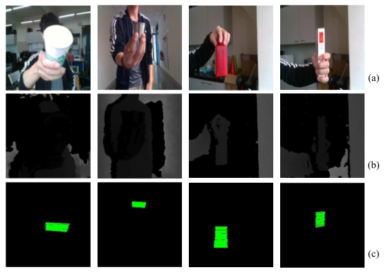
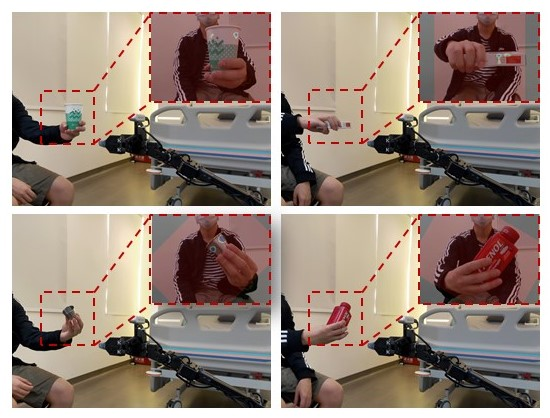

# HERo-hand-object-interaction
  
Our work aims at a medicine delivery task in the ward carried out by a mobile manipulator, using a HERo model that can predict both the hand and the object, a fast grip selection algorithm, and the use of a single RGB-D camera mounted on the robot to achieve versatility. We present an approach for instant and safe human-to-robot handovers using end-to-end robotic vision and systematic robotic arms mounted on mobile vehicles.
  



## I. Prerequisite
 1. OS: Ubuntu 16.04/18.04
 2. GPU with Nvidia driver >= 384.xx (cuda10.0 or newer)
 3. [Docker](https://docs.docker.com/install/linux/docker-ce/ubuntu/)


## II. Docker
```bash
$ cd HERo-hand-object-interaction
$ source docker_run.sh
```
Then enter the "HERo-hand-object-interaction" file in container.
If you want to use another terminal to enter the container, source "docker_join.sh".

## II. Dataset & Model Weight
After enter the docker container.
```bash
$ python3 dataset_download.py
$ source model.download.sh
```



## III. Train
You can use jupyter or execute the python script directly.
```bash
$ python3 HERo_train.py
```

```bash
$ jupyter notebook
```


## IV. Validation
You can use jupyter or execute the python script directly.
```bash
$ python3 HERo_validation.py
```

```bash
$ jupyter notebook
```

# Connect to ROS


```bash
$ cd /home/arg-medical/HERo-hand-object-interaction/
$ source catkin_make.sh
$ source environment.sh
$ roslaunch hero_prediction hero_prediction.launch 
``` 
Then you can open the Rviz to get the real-time predict result.